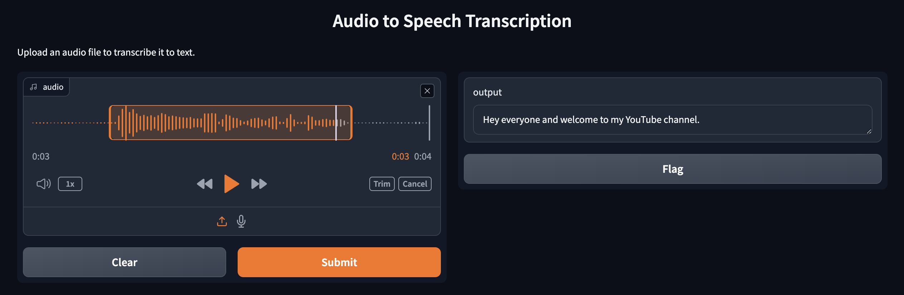

# Audio to Speech Transcription



## Créer un environnement virtuel
```bash
python -m venv .venv
source .venv/bin/activate
```

## Install required packages
```bash
pip install -r requirements.txt
```

## How to use

### Run in terminal
```bash
python app.py
```

### Run in browser
```bash
gradio app-ui.py
```